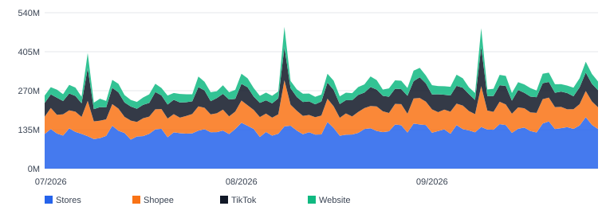
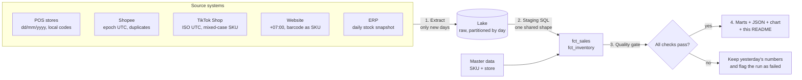

# Retail Data Hub: 5 sources → 1 source of truth, refreshed automatically every morning

> **In one sentence:** a retail chain sells through stores, Shopee, TikTok Shop and a website, and keeps stock in an ERP.
> Each system exports data in its own format. This project pulls all of them into **one place, with one definition per metric,
> checked for errors and refreshed every day without anyone touching it.**

**Why I built it.** In every job, the first problem I see is the same one: several teams, several spreadsheets, several
"revenue" numbers. My approach is always to **centralize the data in one place, define each metric once, and automate the
refresh**, so people spend meetings on decisions instead of on reconciling numbers. This repository is a public,
end-to-end version of how I do that (all data is simulated for the fictional brand *Lumière*; no employer data is used).



---

## 1. Live status (updated by the pipeline itself)

The block below is rewritten by the robot every morning at 06:00 (Vietnam time). If the date is recent, the automation is working.

<!-- STATUS:START -->
**Last run:** 2026-09-29T02:51:28+07:00 (Vietnam time) · **Data through:** 2026-09-28 · **Status:** ✅ success · **Checks:** 8/9 passed · **Runtime:** 2.6 s

| Last 30 days | Value |
|---|---|
| Net revenue | 9,218,641,600 VND |
| vs previous 30 days | +5.7% |
| Orders | 20,310 |
| Average order value | 453,897 VND |
| Channel mix | pos 46% · shopee 25% · tiktok 19% · web 10% |

| Quality check | Result | Detail |
|---|---|---|
| `freshness_pos` | ✅ | partition 2026-09-28 found |
| `freshness_shopee` | ✅ | partition 2026-09-28 found |
| `freshness_tiktok` | ✅ | partition 2026-09-28 found |
| `freshness_web` | ✅ | partition 2026-09-28 found |
| `freshness_erp` | ✅ | partition 2026-09-28 found |
| `valid_quantity` | ✅ | 0 rows with qty <= 0 |
| `sku_mapping` | ⚠️ | 21 rows (0.04% of revenue) unmapped: tiktok:lum_live_combo_09 |
| `reconciliation` | ✅ | worst daily gap 0.000% vs source reports; 0 day(s) over 0.5% |
| `inventory_complete` | ✅ | 325/325 location-SKU rows |

Low stock (under 14 days of cover): Lumière Sleeping Mask (13.9 d), Lumière Night Cream (6.2 d), Lumière Water Gel (10.5 d), Lumière Green Tea Clay (13.9 d), Lumière Calming Mist (10.1 d)
<!-- STATUS:END -->

---

## 2. The problem this solves

| Before (typical situation) | After (this hub) |
|---|---|
| 5 systems, 5 export formats, copied into Excel by hand | One scheduled pipeline pulls all 5 every morning |
| "Revenue" means something different in each team's file | **One** definition of net revenue, written once in SQL |
| The same product has 5 different codes | One **master SKU** that every channel code maps to |
| Errors are found at month-end, if ever | Automatic **quality gate** every day; bad data is never published |
| Reports run on whatever data someone refreshed last | Reports read one set of report-ready tables (marts) |

---

## 3. How it works



| Step | What happens | File |
|---|---|---|
| **1. Extract** | Pulls only the days not loaded yet (a *watermark* remembers the last day per source) and stores them raw, one folder per day | `pipeline/run.py` → `extract()` |
| **2. Transform** | Converts every source into one shared shape: Vietnam time, master SKU, one net-revenue rule, cancelled orders flagged | `sql/staging.sql` |
| **3. Quality gate** | 9 automatic checks (below). Any failure stops publishing | `pipeline/run.py` → `quality()` |
| **4. Publish** | Builds report-ready tables and writes JSON, the chart and the status block above | `sql/marts.sql`, `publish()` |
| **Schedule** | GitHub Actions runs it daily at 06:00 and commits the results | `.github/workflows/retail-data-hub.yml` |

---

## 4. One source of truth: the rules written once

| Question | Rule (applied to every channel) |
|---|---|
| Which day does an order belong to? | Vietnam local time (UTC+7), whatever time zone the source uses |
| Which product is it? | Channel code → `master_sku` through `master/sku_master.csv` |
| What is net revenue? | List price × quantity − seller-funded discount (platform-funded vouchers excluded) |
| Do cancelled orders count? | No. They are kept for audit (`is_valid = false`) but excluded from every report |
| Duplicate rows from an API? | Removed in staging, so they can never inflate revenue |

Because these rules live in one SQL file, **changing a definition changes it everywhere at once**.

---

## 5. Automatic quality checks

| Check | What it protects against | If it fails |
|---|---|---|
| `freshness_*` (×5) | A source silently stopped sending data | Run fails |
| `valid_quantity` | Zero or negative quantities | Run fails |
| `sku_mapping` | New product codes missing from master data | Warning; fails if > 1% of revenue |
| `reconciliation` | Hub total drifting from each system's own daily report (> 0.5%) | Run fails |
| `inventory_complete` | Missing stock rows for a store or product | Run fails |

The sample data contains real-world traps on purpose: Shopee duplicates, TikTok SKUs in mixed case, a livestream combo
code that is not in master data yet. The checks catch each of them, and the status block shows what was found.

---

## 6. Built to stay fast and cheap

- **Incremental loads:** each run reads only new days, not the full history.
- **Idempotent:** re-running the same day produces the same result; nothing is double-counted.
- **Partition pruning:** reports read only the last 90 daily partitions (the run log records files read vs. files in the lake).
- **Retention:** raw data older than 120 days is removed automatically, so storage stays flat.
- **Ready for BigQuery:** `sql/bigquery_ddl.sql` shows the production table, partitioned by day and clustered by
  channel/store/SKU, with a mandatory partition filter so no query can scan all history by accident.

---

## 7. Repository layout

```
0. [Python] Retail Data Hub/
├── pipeline/
│   ├── sources.py      simulated source systems (5 formats, deterministic)
│   └── run.py          extract → transform → quality gate → publish
├── sql/
│   ├── staging.sql     the single definitions (one shared shape)
│   ├── marts.sql       report-ready tables
│   └── bigquery_ddl.sql production table design
├── master/             sku_master.csv, store_master.csv (master data)
├── lake/               raw data, one folder per source per day (written by the pipeline)
├── state/              watermark: last day loaded per source
└── output/             summary, SKU, store, daily JSON + chart + run log
```

---

## 8. Run it yourself

```bash
pip install -r requirements.txt
python pipeline/run.py            # daily run: loads only new days
python pipeline/run.py --rebuild  # start over: backfill 120 days
```

Takes about 3 seconds on a laptop. Output lands in `output/`.

---

## 9. Tech stack

Python · SQL (DuckDB locally, BigQuery design for production) · GitHub Actions (scheduling) · Git (versioned data and logic)

---

## Tóm tắt tiếng Việt

Dự án mô phỏng việc **gom dữ liệu từ 5 hệ thống** (cửa hàng, Shopee, TikTok Shop, website, ERP tồn kho) **về một nguồn duy nhất**,
thống nhất **một định nghĩa** cho mỗi chỉ số, **tự kiểm tra lỗi** và **tự chạy mỗi sáng** bằng GitHub Actions.
Đây là bản công khai, dùng dữ liệu giả lập, của cách tôi làm việc với dữ liệu: tập trung một nguồn, tự động hoá và tối ưu để báo cáo luôn đúng và nhất quán.
