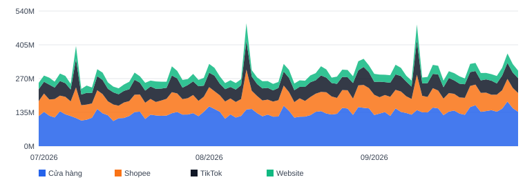
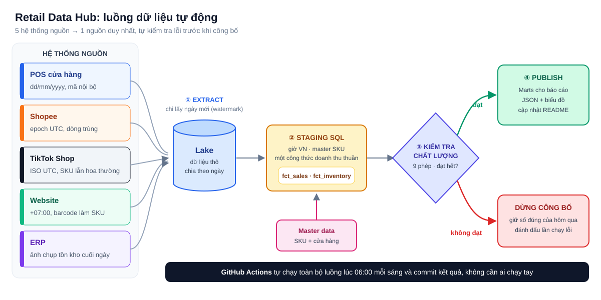

# Retail Data Hub: 5 nguồn dữ liệu → 1 nguồn duy nhất, tự cập nhật mỗi sáng

> **Tóm tắt một câu:** một chuỗi bán lẻ bán hàng qua cửa hàng, Shopee, TikTok Shop và website, quản lý tồn kho trên ERP.
> Mỗi hệ thống xuất dữ liệu theo một kiểu riêng. Dự án này gom tất cả về **một nơi, mỗi chỉ số chỉ có một định nghĩa,
> tự kiểm tra lỗi và tự làm mới mỗi ngày mà không cần ai chạy tay.**

**Vì sao tôi làm dự án này.** Ở công ty nào, vấn đề đầu tiên tôi gặp cũng giống nhau: nhiều phòng ban, nhiều file Excel,
nhiều con số "doanh thu" khác nhau. Cách tôi luôn làm là **tập trung dữ liệu về một nguồn, định nghĩa mỗi chỉ số một lần
và tự động hoá việc cập nhật**, để các cuộc họp dành cho việc ra quyết định thay vì ngồi đối chiếu số. Repo này là phiên bản
công khai, làm trọn từ đầu đến cuối, của cách tôi làm việc đó (toàn bộ dữ liệu là giả lập cho thương hiệu hư cấu *Lumière*;
không dùng dữ liệu của bất kỳ công ty nào).



---

## 1. Trạng thái hiện tại (do pipeline tự cập nhật)

Khối bên dưới được robot ghi lại mỗi sáng lúc 06:00 (giờ Việt Nam). Nếu ngày chạy là ngày gần nhất, nghĩa là tự động hoá đang hoạt động.

<!-- STATUS:START -->
**Lần chạy gần nhất:** 29/09/2026 11:41 (giờ Việt Nam) · **Dữ liệu đến ngày:** 28/09/2026 · **Trạng thái:** ✅ thành công · **Kiểm tra:** đạt 8/9 · **Thời gian chạy:** 10.6 giây

| 30 ngày gần nhất | Giá trị |
|---|---|
| Doanh thu thuần | 9,218,641,600 đ |
| So với 30 ngày trước đó | +5.7% |
| Số đơn hàng | 20,310 |
| Giá trị trung bình mỗi đơn | 453,897 đ |
| Tỷ trọng theo kênh | Cửa hàng 46% · Shopee 25% · TikTok 19% · Website 10% |

| Phép kiểm tra | Kết quả | Chi tiết |
|---|---|---|
| `freshness_pos` | ✅ | phân vùng 28/09/2026 đã có |
| `freshness_shopee` | ✅ | phân vùng 28/09/2026 đã có |
| `freshness_tiktok` | ✅ | phân vùng 28/09/2026 đã có |
| `freshness_web` | ✅ | phân vùng 28/09/2026 đã có |
| `freshness_erp` | ✅ | phân vùng 28/09/2026 đã có |
| `valid_quantity` | ✅ | 0 dòng có số lượng <= 0 |
| `sku_mapping` | ⚠️ | 21 dòng (0.04% doanh thu) chưa map mã: tiktok:lum_live_combo_09 |
| `reconciliation` | ✅ | lệch lớn nhất trong ngày 0.000% so với báo cáo nguồn; 0 ngày vượt 0.5% |
| `inventory_complete` | ✅ | 325/325 dòng địa điểm-SKU |

Sắp hết hàng (đủ bán dưới 14 ngày): Lumière Sleeping Mask (13.9 ngày), Lumière Night Cream (6.2 ngày), Lumière Water Gel (10.5 ngày), Lumière Green Tea Clay (13.9 ngày), Lumière Calming Mist (10.1 ngày)
<!-- STATUS:END -->

---

## 2. Bài toán được giải quyết

| Trước đây (tình huống thường gặp) | Sau khi có hub |
|---|---|
| 5 hệ thống, 5 kiểu file xuất, copy tay vào Excel | Một pipeline chạy theo lịch, tự lấy cả 5 nguồn mỗi sáng |
| Mỗi phòng hiểu "doanh thu" một kiểu | **Một** định nghĩa doanh thu thuần, viết một lần bằng SQL |
| Cùng một sản phẩm có 5 mã khác nhau | Một **mã SKU chuẩn (master SKU)**, mọi mã của từng kênh đều quy về mã này |
| Lỗi dữ liệu chỉ phát hiện lúc chốt tháng, hoặc không bao giờ | **Cổng kiểm tra chất lượng** chạy tự động mỗi ngày; dữ liệu lỗi không bao giờ được công bố |
| Báo cáo chạy trên dữ liệu ai đó làm mới gần nhất | Mọi báo cáo đọc chung một bộ bảng đã sẵn sàng (marts) |

---

## 3. Cách hoạt động



| Bước | Việc được làm | File |
|---|---|---|
| **1. Extract** | Chỉ lấy những ngày chưa nạp (*watermark* ghi nhớ ngày cuối cùng đã nạp của từng nguồn), lưu dữ liệu thô, mỗi ngày một thư mục | `pipeline/run.py` → `extract()` |
| **2. Transform** | Đưa mọi nguồn về một cấu trúc chung: giờ Việt Nam, mã SKU chuẩn, một công thức doanh thu thuần, đánh dấu đơn huỷ | `sql/staging.sql` |
| **3. Kiểm tra chất lượng** | 9 phép kiểm tra tự động (bên dưới). Chỉ cần một lỗi là dừng công bố | `pipeline/run.py` → `quality()` |
| **4. Publish** | Tạo các bảng sẵn sàng cho báo cáo, xuất JSON, biểu đồ và khối trạng thái ở trên | `sql/marts.sql`, `publish()` |
| **Lịch chạy** | GitHub Actions chạy mỗi ngày lúc 06:00 và tự commit kết quả | `.github/workflows/retail-data-hub.yml` |

---

## 4. Một nguồn sự thật: quy tắc chỉ viết một lần

| Câu hỏi | Quy tắc (áp dụng cho mọi kênh) |
|---|---|
| Đơn hàng thuộc ngày nào? | Theo giờ Việt Nam (UTC+7), bất kể nguồn dùng múi giờ nào |
| Đây là sản phẩm nào? | Mã của từng kênh → `master_sku` qua file `master/sku_master.csv` |
| Doanh thu thuần là gì? | Giá niêm yết × số lượng − giảm giá do shop chịu (không trừ voucher do sàn tài trợ) |
| Đơn huỷ có tính không? | Không. Vẫn giữ lại để đối soát (`is_valid = false`) nhưng loại khỏi mọi báo cáo |
| API trả về dòng trùng? | Loại bỏ ngay ở bước staging, nên không bao giờ làm phồng doanh thu |

Vì các quy tắc này nằm trong một file SQL, **đổi định nghĩa một lần là mọi báo cáo đổi theo**.

---

## 5. Kiểm tra chất lượng tự động

| Phép kiểm tra | Bảo vệ khỏi điều gì | Nếu không đạt |
|---|---|---|
| `freshness_*` (×5) | Một nguồn âm thầm ngừng gửi dữ liệu | Lần chạy thất bại |
| `valid_quantity` | Số lượng bằng 0 hoặc âm | Lần chạy thất bại |
| `sku_mapping` | Mã sản phẩm mới chưa có trong master data | Cảnh báo; thất bại nếu chiếm > 1% doanh thu |
| `reconciliation` | Tổng của hub lệch với báo cáo ngày của từng hệ thống (> 0.5%) | Lần chạy thất bại |
| `inventory_complete` | Thiếu dòng tồn kho của một cửa hàng hoặc sản phẩm | Lần chạy thất bại |

Dữ liệu mẫu cố ý chứa các "bẫy" thường gặp ngoài thực tế: dòng trùng từ Shopee, SKU TikTok lẫn chữ hoa chữ thường, một mã
combo livestream chưa có trong master data. Các phép kiểm tra bắt được từng lỗi, và khối trạng thái hiển thị những gì tìm thấy.

---

## 6. Thiết kế để luôn nhanh và rẻ

- **Nạp tăng dần (incremental):** mỗi lần chạy chỉ đọc ngày mới, không đọc lại toàn bộ lịch sử.
- **Chạy lại an toàn (idempotent):** chạy lại cùng một ngày cho ra cùng một kết quả; không bị cộng trùng.
- **Chỉ đọc phân vùng cần thiết (partition pruning):** báo cáo chỉ đọc 90 phân vùng ngày gần nhất (log ghi lại số file đã đọc so với tổng số file trong lake).
- **Tự dọn dữ liệu cũ (retention):** dữ liệu thô cũ hơn 120 ngày được xoá tự động, dung lượng không phình ra.
- **Sẵn sàng cho BigQuery:** `sql/bigquery_ddl.sql` mô tả bảng production, chia phân vùng theo ngày, cluster theo
  kênh/cửa hàng/SKU, bắt buộc có điều kiện lọc phân vùng để không truy vấn nào lỡ quét toàn bộ lịch sử.

---

## 7. Cấu trúc thư mục

```
0.1. [Python] Retail Data Hub/
├── pipeline/
│   ├── sources.py      giả lập các hệ thống nguồn (5 định dạng, kết quả cố định)
│   └── run.py          extract → transform → kiểm tra chất lượng → publish
├── sql/
│   ├── staging.sql     nơi duy nhất chứa các định nghĩa (một cấu trúc chung)
│   ├── marts.sql       các bảng sẵn sàng cho báo cáo
│   └── bigquery_ddl.sql thiết kế bảng production
├── master/             sku_master.csv, store_master.csv (master data)
├── lake/               dữ liệu thô, mỗi nguồn mỗi ngày một thư mục (do pipeline ghi)
├── state/              watermark: ngày cuối cùng đã nạp của từng nguồn
└── output/             JSON tổng hợp, theo SKU, cửa hàng, theo ngày + biểu đồ + log chạy
```

---

## 8. Tự chạy thử

```bash
pip install -r requirements.txt
python pipeline/run.py            # chạy hằng ngày: chỉ nạp ngày mới
python pipeline/run.py --rebuild  # làm lại từ đầu: nạp lại 120 ngày
```

Chạy khoảng 3 giây trên laptop. Kết quả nằm trong thư mục `output/`.

---

## 9. Công nghệ sử dụng

Python · SQL (DuckDB khi chạy local, thiết kế cho BigQuery khi lên production) · GitHub Actions (lập lịch) · Git (quản lý phiên bản dữ liệu và logic)
