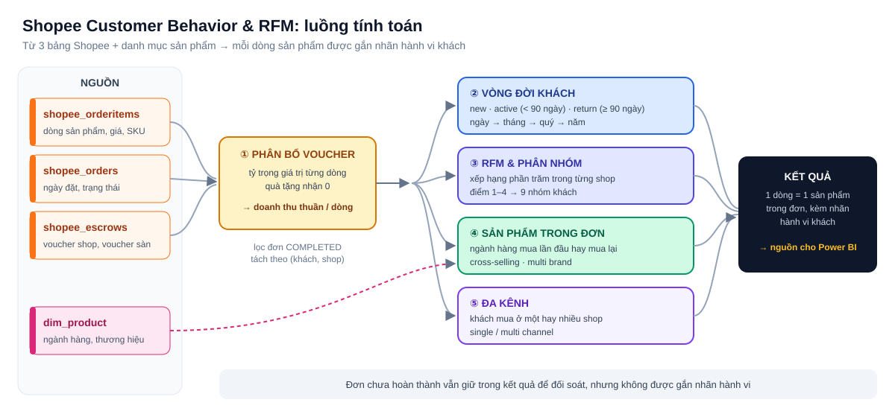

# Shopee Customer Behavior & RFM: hiểu khách mua lần đầu, quay lại hay đang rời bỏ

> **Tóm tắt một câu:** một câu SQL trên BigQuery biến dữ liệu đơn hàng Shopee của nhiều shop thành bảng phân tích khách hàng:
> mỗi dòng sản phẩm được gắn **doanh thu thuần sau voucher**, **loại khách new / active / return**, **điểm RFM**,
> **mua lần đầu hay mua lại** và **khách một shop hay nhiều shop**. Power BI chỉ việc đọc và vẽ.

Người làm marketing và vận hành sàn thường hỏi: *tháng này bao nhiêu khách mới, bao nhiêu khách cũ quay lại, khách quay lại sau bao lâu,
nhóm khách nào đang có nguy cơ mất, khách có mua chéo ngành hàng hay nhiều shop không.* Dữ liệu gốc của Shopee không trả lời trực tiếp
những câu này. Truy vấn này tính sẵn mọi nhãn ở tầng SQL, để mọi báo cáo dùng chung **một định nghĩa** và không phải tính lại trong DAX.

---

## 1. Đầu vào và đầu ra

| | Nội dung |
|---|---|
| **Đầu vào** | `shopee_orderitems` (dòng sản phẩm), `shopee_orders` (ngày đặt, trạng thái), `shopee_escrows` (voucher shop và voucher sàn), `dim_product` (ngành hàng, thương hiệu) |
| **Đầu ra** | 1 dòng = 1 sản phẩm trong đơn, giữ toàn bộ cột gốc và thêm các cột ở mục 3 |
| **Phạm vi** | Đơn từ 01/01/2024. Chỉ đơn `COMPLETED` được dùng để tính hành vi; đơn trạng thái khác vẫn giữ lại để đối soát |
| **Đơn vị phân tích** | Cặp **(khách, shop)**: cùng một người mua ở 2 shop được xem là 2 hành trình riêng |

---

## 2. Quy tắc tính

### Doanh thu thuần theo dòng sản phẩm

Voucher trên Shopee áp cho cả đơn, không áp cho từng sản phẩm. Để biết doanh thu thật của từng SKU, voucher được chia theo tỷ trọng giá trị:

| Bước | Công thức |
|---|---|
| Giá trị dòng | giá sau giảm × số lượng |
| Tỷ trọng | giá trị dòng ÷ tổng giá trị các dòng không phải quà tặng trong đơn (quà tặng = 0) |
| Voucher phân bổ | voucher shop × tỷ trọng (tương tự cho voucher sàn và tổng tiền đơn) |
| **Doanh thu thuần** | giá trị dòng − voucher shop phân bổ |

### Loại khách: new, active, return

| Loại | Điều kiện (so với lần mua trước đó của cùng khách ở cùng shop) |
|---|---|
| `new` | Lần mua đầu tiên |
| `active` | Quay lại trong vòng dưới 90 ngày |
| `return` | Quay lại sau 90 ngày trở lên |

Nhãn được tính theo **ngày**, rồi gộp lên **tháng, quý, năm** theo thứ tự ưu tiên: kỳ có ngày `new` → `new`;
không có `new` nhưng có ngày `return` → `return`; còn lại → `active`.
Cột `monthly_days_diff` cho biết khách quay lại sau bao nhiêu ngày, dùng để vẽ phân bố "quay lại sau 1, 2, …, >6 tháng".

### RFM

| Chỉ số | Cách đo |
|---|---|
| **R**ecency | Số ngày từ lần mua gần nhất đến hôm nay |
| **F**requency | Số ngày có mua hàng |
| **M**onetary | Tổng doanh thu thuần |

Mỗi chỉ số được xếp hạng phần trăm **trong từng shop**, chia 4 mức: **1 là tốt nhất, 4 là kém nhất**. Ghép 3 điểm được mã RFM, từ đó xếp nhóm:

| Nhóm | Mã RFM |
|---|---|
| Best Customers | 111 |
| Loyal Customers | 112, 113, 114 |
| Big Spenders | 121, 131, 221, 231 |
| Potential Loyalists | R 1–2, F 2–3, M 2–4 |
| New Customers | R 1–2, F 4 |
| Almost Lost | 211–214 |
| Hibernating | R 3–4, F 1 |
| Lost Customers | R 3–4, F 2 |
| Lost Bad Customers | R 3–4, F 3–4 |

Chín nhóm phủ kín đủ 64 tổ hợp điểm, không có khách nào bị bỏ sót hay rơi vào hai nhóm.

### Sản phẩm và đa kênh

| Cột | Ý nghĩa |
|---|---|
| `type_product` | `new` nếu đây là lần đầu khách mua ngành hàng (category cấp 3) này ở shop này, ngược lại `old` |
| `type_combine_product` | `Cross-Selling` nếu một đơn có từ 2 ngành hàng trở lên |
| `type_combine_brand` | `Multi Brand` nếu một đơn có từ 2 thương hiệu trở lên |
| `type_combine_orgname` | `Multi Channel` nếu khách từng mua ở từ 2 shop trở lên |
| `range_combine_product` | Số ngành hàng trong đơn: 1 món, 2 món, >2 món (không tính quà tặng) |

---

## 3. Các cột được thêm vào

| Nhóm | Cột |
|---|---|
| Doanh thu | `revenue_ratio`, `revenue_allocated`, `voucher_from_seller_allocated`, `voucher_from_shopee_allocated`, `order_total_amount_allocated`, `model_sku_adj` |
| Vòng đời theo ngày | `daily_total_orders`, `daily_first_order`, `daily_days_diff`, `daily_type_customer` |
| Vòng đời theo kỳ | `buyer_month`, `total_orders`, `days_diff`, `type_customer`, `monthly_type_customer`, `buyer_quarter`, `quarterly_type_customer`, `buyer_year`, `yearly_type_customer`, `monthly_days_diff`, `range_monthly_days_diff` |
| RFM | `recency`, `frequency`, `monetary`, `r_score`, `f_score`, `m_score`, `rfm_score`, `rfm_segment` |
| Sản phẩm | `category_lv1`, `category_lv2`, `category_lv3`, `brand`, `combine_product`, `combine_brand`, `type_product`, `type_combine_product`, `type_combine_brand`, `range_combine_product` |
| Đa kênh | `combine_orgname`, `type_combine_orgname` |

---

## 4. Cách tổ chức câu SQL

File `shopee_customer_behavior.sql` gồm các khối CTE theo đúng thứ tự trong sơ đồ, mỗi khối một việc:

| Khối | CTE |
|---|---|
| 0. Danh mục shop | `shop_map`: quy đổi tên shop ra mã ngắn, thêm shop mới chỉ cần sửa ở đây |
| 1–3. Chuẩn bị dòng sản phẩm | `order_lines` → `order_lines_ratio` → `raw_orderitem` → `completed_orderitem` |
| 4. Vòng đời khách | `monthly_*`, `daily_*`, `monthly/quarterly/yearly_customer_type` |
| 5. RFM | `rfm_user` → `rfm_score` → `segment_table` |
| 6–7. Sản phẩm, đa kênh | `buyer_first_purchase`, `order_combined_data`, `buyer_orgname_data` |
| 8–9. Ghép kết quả | `main_query` và các nhóm hiển thị cuối cùng |

Một vài lựa chọn thiết kế:

- **Tỷ lệ phân bổ tính một lần** rồi dùng lại cho mọi loại voucher, tránh lặp cùng một biểu thức nhiều nơi.
- **Gộp tháng, quý, năm trực tiếp từ nhãn theo ngày** nên ba cấp luôn nhất quán với nhau.
- **Xếp hạng RFM trong từng shop** để shop nhỏ không bị shop lớn lấn át điểm.
- **Giữ cả đơn chưa hoàn thành** trong kết quả, chỉ không gắn nhãn, nên tổng số đơn vẫn đối soát được với Shopee.

---

## 5. Cách dùng

1. Đổi `retail_dw` thành dataset của bạn (4 bảng nguồn).
2. Cập nhật `shop_map` theo tên các shop.
3. Lưu thành view trên BigQuery rồi kết nối từ Power BI.

---

## 6. Công nghệ sử dụng

BigQuery SQL (window functions: `LAG`, `PERCENT_RANK`, `SUM OVER`; `STRING_AGG`, `UNNEST`, `LOGICAL_OR`) · Power BI

*Tên dataset và tên shop trong repo đã được thay bằng tên giả định.*
