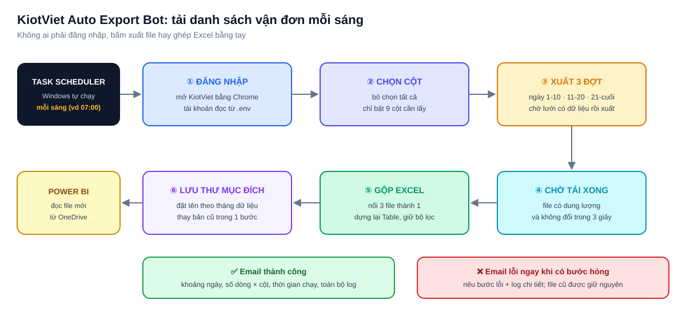

# KiotViet Auto Export Bot: tự tải danh sách vận đơn về đúng thư mục mỗi sáng

> **Tóm tắt một câu:** bot Python tự đăng nhập KiotViet, xuất danh sách vận đơn từ đầu tháng đến hôm qua, gộp thành một file Excel
> và đặt vào thư mục mà Power BI đọc. Xong việc thì gửi email báo kết quả. Không ai phải chạy tay.

KiotViet không có sẵn nút "tự gửi báo cáo mỗi ngày", và mỗi lần xuất chỉ được một lượng dữ liệu giới hạn. Muốn có số vận đơn cả tháng,
ai đó phải đăng nhập, chọn cột, chọn từng khoảng ngày, bấm xuất, chờ, tải về rồi ghép Excel. Việc này lặp lại mỗi sáng và dễ sai:
chọn thiếu cột, sót ngày, ghép trùng file. Bot này làm thay toàn bộ các bước đó, luôn theo cùng một cách.



---

## 1. Bot làm gì

| Bước | Việc được làm | Hàm |
|---|---|---|
| **1. Đăng nhập** | Mở Chrome, đăng nhập bằng tài khoản trong `.env`, bỏ tick "Duy trì đăng nhập" | `login_kiotviet()` |
| **2. Chọn cột** | Mở popup ẩn/hiện cột, bỏ chọn tất cả rồi chỉ bật 9 cột cần lấy, nên file xuất luôn cùng một cấu trúc | `setup_delivery_columns()` |
| **3. Xuất theo đợt** | Chia tháng thành 3 đợt (1–10, 11–20, 21–cuối), chọn tất cả chi nhánh, chờ lưới có dữ liệu rồi bấm Xuất file | `export_range()` |
| **4. Chờ tải xong** | Chỉ coi là xong khi file có dung lượng và không đổi trong 3 giây, tránh đọc file đang tải dở | `wait_for_files()` |
| **5. Gộp Excel** | Lấy file đầu làm mẫu, nối dữ liệu các file sau, dựng lại Excel Table để giữ định dạng và bộ lọc | `merge_excel_files()` |
| **6. Lưu file** | Đặt tên theo tháng của dữ liệu (`DanhSachVanDon_YYYYMM.xlsx`), thay bản cũ trong một bước | `move_file()` |
| **7. Báo kết quả** | Email xanh khi thành công, email đỏ ngay khi có bước lỗi, kèm toàn bộ log | `send_email()` |

**Khoảng ngày được tải**

| Ngày chạy | Dữ liệu được tải |
|---|---|
| Ngày 2 đến cuối tháng | Từ ngày 01 đến hôm qua của tháng hiện tại |
| Ngày 1 | Trọn tháng trước, để file của tháng cũ được chốt đủ ngày |

---

## 2. Các điểm giúp bot chạy ổn định

- **Chờ dữ liệu theo tín hiệu, không đoán giờ:** bot chờ lưới dữ liệu có dòng thật (hoặc có mã hóa đơn, mã vận đơn) rồi mới xuất,
  tối đa 10 phút. KiotViet chậm thì bot chờ lâu hơn, nhanh thì chạy tiếp ngay.
- **Nhiều cách nhận biết dữ liệu:** thử lần lượt nhiều XPath cho bảng, rồi mới dò mã trên trang, vì giao diện KiotViet có thể đổi.
- **Thử lại khi mở popup lỗi:** bước hay lỗi nhất (mở popup chọn cột) được thử lại một lần trước khi báo lỗi.
- **Không bao giờ để file nửa vời:** file gộp được ghi ra chỗ tạm, chỉ thay file cũ khi đã hoàn chỉnh. Lỗi ở bất kỳ bước nào thì file cũ giữ nguyên.
- **Không lộ tài khoản:** mọi thông tin đăng nhập và đường dẫn nằm trong `.env` (đã chặn bằng `.gitignore`), code không chứa mật khẩu.

---

## 3. Cài đặt và chạy

```bash
pip install -r requirements.txt
copy .env.example .env        # rồi điền tài khoản KiotViet, thư mục đích, Gmail
python kiotviet_vandon_bot.py
```

**Chạy tự động mỗi sáng:** tạo một tác vụ trong Windows Task Scheduler gọi `run_daily.bat` (ví dụ 07:00 hằng ngày).
File bat ghi thêm log vào `run_log.txt` để xem lại khi cần.

**Email báo kết quả** dùng Gmail App Password (Google Account → Security → App passwords), không dùng mật khẩu đăng nhập Gmail.

---

## 4. Cấu trúc thư mục

```
0.3. [Python] KiotViet Auto Export Bot/
├── kiotviet_vandon_bot.py   toàn bộ bot: đăng nhập → chọn cột → xuất → chờ → gộp → lưu → email
├── .env.example             mẫu cấu hình (copy thành .env)
├── requirements.txt         thư viện cần cài
├── run_daily.bat            file để Task Scheduler gọi mỗi sáng
└── flow.svg                 sơ đồ luồng chạy
```

---

## 5. Công nghệ sử dụng

Python · Selenium (tự động hoá trình duyệt) · openpyxl (gộp Excel, giữ Table) · smtplib (email HTML) · python-dotenv · Windows Task Scheduler
